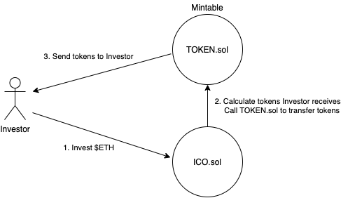

# ICO Token Model  

Most startups don't have all ICO details fleshed out
- Best strategy will give the most options
- This model can you test the desirability of your ICO

This strategy creates: 
1. ERC20 Token contract
2. ICO contract to receive Ether and send tokens

### Presale Model
* Investor contributes to ICO with Ether
* ICO acts like vending machine. When sent Ether, it talks to TOKEN.sol and sends Investor tokens

Investor may want to invest with: BTC, USD/WIRE, LINK
* Payments needs to be with ETH, on-chain
* This is bootstrapped version of ICO - more affordable

If you don’t have all the tokenomics figured out, can start token supply at 0 and mint tokens as you go
* Caveat: People can say team can mint infinite tokens. Some level of trust needed - in pre-sale, identities are known, reputation at stake
* E.g. Mint 1M tokens and send to ICO contract. Transfer tokens to Investors as payments are made.
* No hardcap that needs to be reached like some types of crowdsales (e.g. Kickstarter model where funds are returned if target isn’t hit)
* Don’t need token distribution figured out yet (e.g. 75% crowdsale, 15% team, 10% presale). Can figure this out with initial funding

Presale model has some risks and benefits:
* Funding goes directly to team, no covenant to deliver on any promises/roadmap
* Can set pre-sale rate to receive more tokens than crowdsale
* Can take BTC, Wire transfers, etc. offlines, and can mint them tokens w/o ETH transaction

Investor Experience: in order to be KYC compliant, need to whitelist ETH address on ICO contract
* In actual Presale, investors can apply through a KYC portal. 
* Project team can whitelist investor’s address, allowing Investor ability to send ETH to participate in ICO